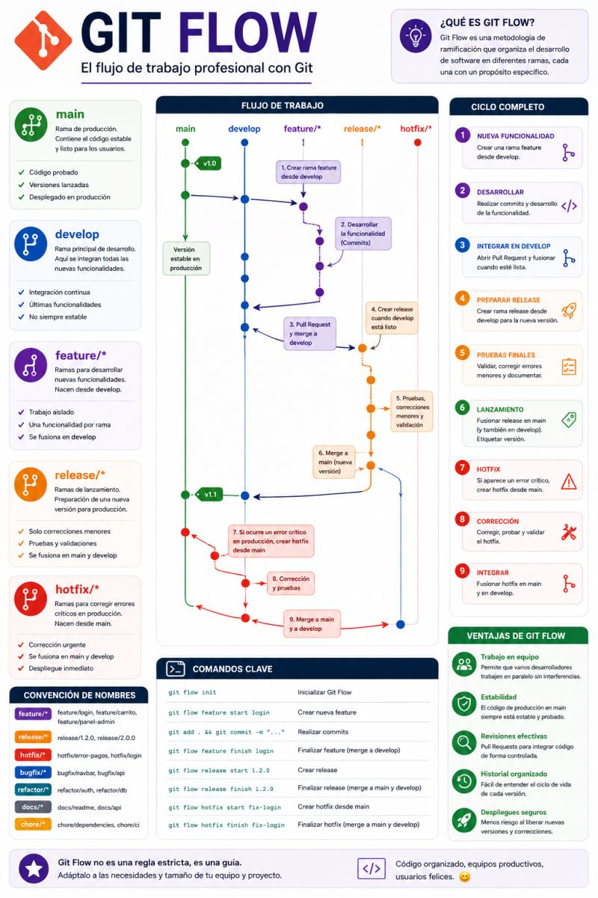
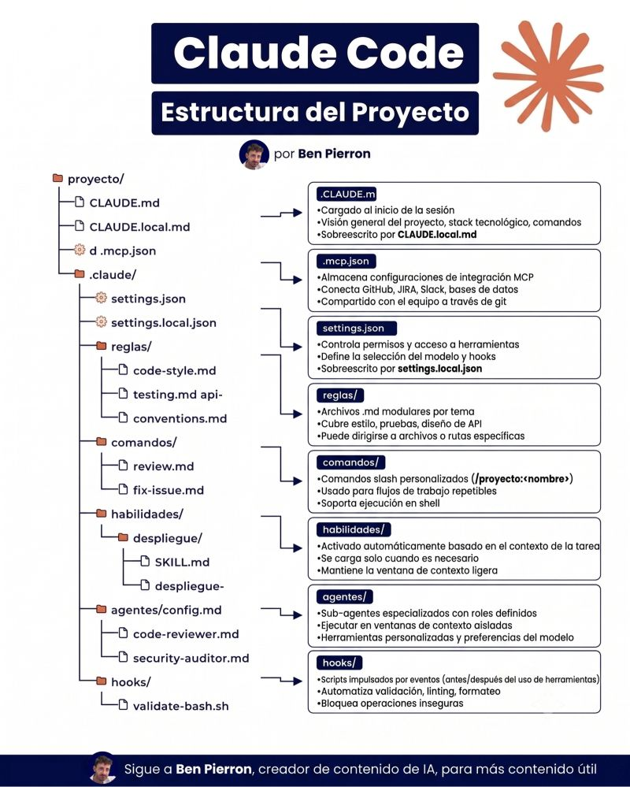
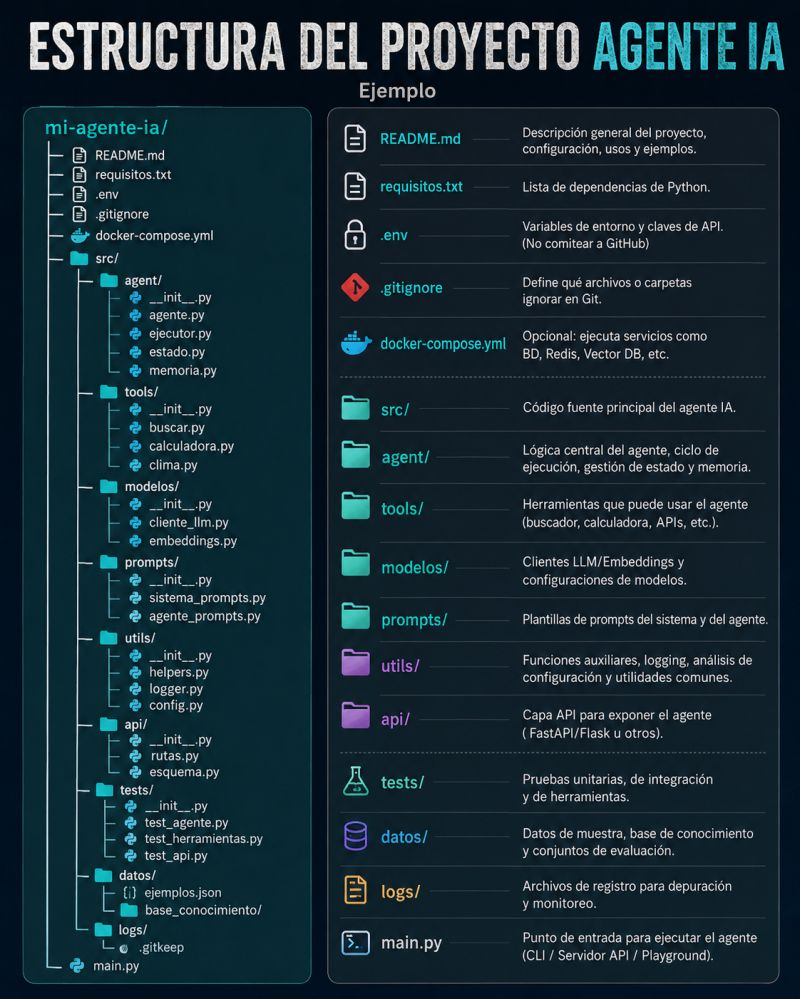

# Ayudas y recursos

Esta carpeta reúne material que **no pertenece a una materia puntual** pero
sirve para toda la carrera: cheat sheets, infografías sobre Git/GitHub,
guías para usar IA en el estudio (NotebookLM, resúmenes, etc.) y cualquier
otro recurso general. La idea es que sea un cajón de herramientas aparte de
los apuntes de `Materias/`.

---

## 🗂️ Cheat sheets e infografías

  
  

  
  

  

- [Git cheat sheet (PDF)](../assets/ayudas/git-cheat-sheet-education.pdf) — comandos básicos de Git para tener a mano.
- **Comandos Git** — referencia rápida de los comandos más usados (init, commit, branch, merge, etc.).
- **GitHub · conceptos clave** — guía visual para entender repositorio, commit, branch, PR, issues y el flujo básico de GitHub.
- **Git Flow** — estrategia de ramas (`main`, `develop`, `feature/*`, `release/*`, `hotfix/*`) para trabajar en equipo de forma ordenada.
- **Estructura de proyecto (Claude Code / agentes IA)** — ejemplos de organización de carpetas para proyectos que usan IA como asistente de desarrollo.

## 🤖 IA para estudiar (NotebookLM y similares)

[NotebookLM](https://notebooklm.google.com/) (u otras herramientas de IA)
permite subir tus apuntes/PDFs de una materia y generar resúmenes, audios
tipo podcast y responder preguntas citando la fuente. Es un buen
complemento para repasar antes de un parcial o final.

## 🎥 Videos

- [Curso de Git y GitHub desde cero para aportar a proyectos](https://www.youtube.com/watch?v=niPExbK8lSw&t=518s) — cómo clonar, hacer commits y abrir un Pull Request para contribuir a un repositorio como este.
- [Curso completo de Git y GitHub desde cero para principiantes](https://www.youtube.com/watch?v=3GymExBkKjE&t=8547s) — curso largo que cubre Git y GitHub de punta a punta, desde conceptos básicos hasta flujo de trabajo colaborativo.
- [Curso de Docker desde cero hasta despliegue a producción](https://www.youtube.com/watch?v=wZnddhLrmiM) — introducción a contenedores con Docker y cómo llevar una app a producción.

---

## ➕ Cómo sumar un recurso

¿Tenés un cheat sheet, un notebook de IA o un video para sumar? Abrí un
issue o un PR agregando la fila/link correspondiente — ver
[CONTRIBUTING.md](../CONTRIBUTING.md).
