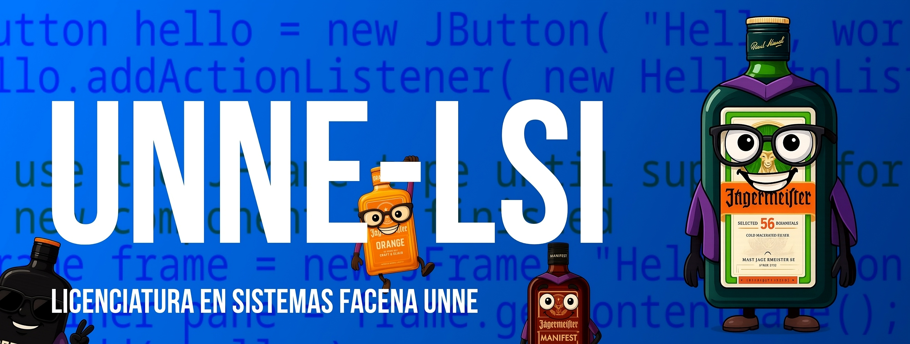
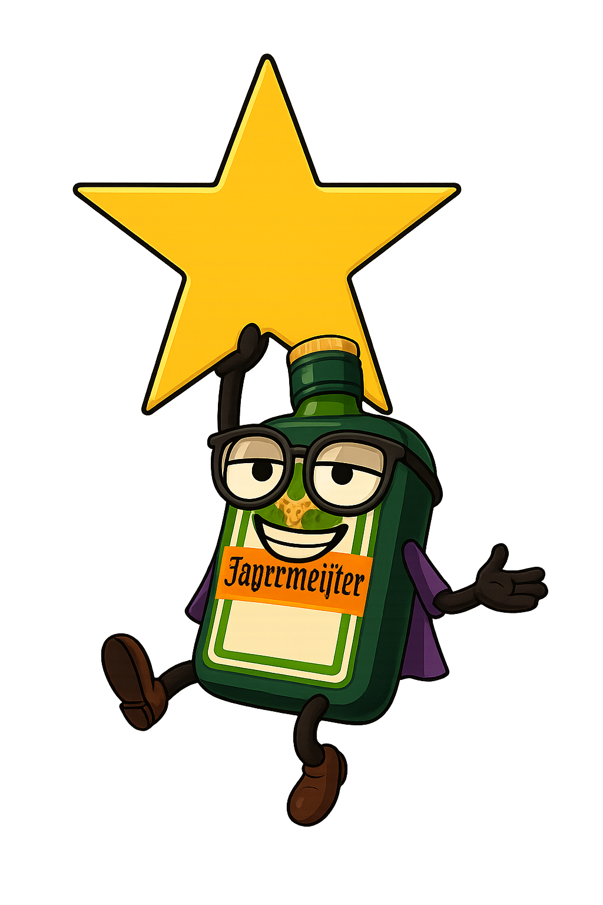

<p align="center">
  
</p>

<p align="center">
  <a href="https://github.com/tobiager">
    
  </a>
</p>

<p align="center">
  
  
  
  
</p>

<p align="center">
<a href="https://github.com/tobiager/UNNE-LSI/stargazers">
  
</a>
<a href="https://github.com/tobiager/UNNE-LSI/network/members">
  
</a>
<a href="https://github.com/tobiager/UNNE-LSI/pulls">
  
</a>
<a href="https://github.com/tobiager/UNNE-LSI/issues">
  
</a>
<a href="https://github.com/tobiager/UNNE-LSI/graphs/contributors">
  
</a>
<a href="https://github.com/tobiager/UNNE-LSI/blob/main/LICENSE">
  
</a>

</p>

#  LSI UNNE — Apuntes, prácticos y guías por materia

Hola! Soy **Tobias**, ingresé a la carrera en **2023** bajo el **plan 2009** y actualmente estoy en **3er año**.  
Decidí armar este repositorio para dejar un registro de mi recorrido y que también le sirva a quien venga detrás.  

Este espacio **NO es oficial**, pero vas a encontrar **apuntes, prácticos, guías, parciales resueltos y tips de cursada** de la **Licenciatura en Sistemas de Información (FaCENA – UNNE)**.

> “El que estudia con parciales viejos, aprueba dos veces” — proverbio lsi 🧓

---

## 📌 Índice rápido

- [ Sobre la carrera](#-sobre-la-carrera)
- [ Estructura del repositorio](#-estructura-del-repositorio)
- [ Instalación y uso local](#-instalación-y-uso-local)
- [ Si no sabés cómo usar GitHub](#-si-no-sabés-cómo-usar-github)
- [ Planes de estudio](#-planes-de-estudio)
- [ Materias](#-materias)
- [ Tips de cursada](#-tips-de-cursada)
- [ Cómo contribuir](#%EF%B8%8F-cómo-contribuir)
- [ Licencia](#-licencia)

---

## 📖 Sobre la carrera

La **Licenciatura en Sistemas de Información (LSI)** es una carrera de **5 años** dictada en la **Facultad de Ciencias Exactas y Naturales y Agrimensura (FaCENA – UNNE)**, en Corrientes, Argentina.  


### Características principales:
- **Duración oficial:** 5 años.  
- **Planes:** 2009 (en extinción) y 2023 (nuevo).  
- **Modalidad:** presencial y virtual, con materias cuatrimestrales.  
- **Perfil del egresado:** desarrollo de software, gestión de proyectos, docencia e investigación.  
- **Salida laboral:** analista, programador, etc.  


---

## 📂 Estructura del repositorio

```text
Materias/
  ├── <Materia>/README.md   # apuntes, prácticas y consejos
planes/
  ├── 2009.md               # plan 2009 detallado
  └── 2023.md               # plan 2023 detallado
meta/
  └── mapping-planes.yaml   # mapeo materia → {año, cuatri} por plan
assets/
  └── facena.png, stickers  # imágenes usadas en el repo
```

- **Materias/** → Cada carpeta tiene un `README.md` con apuntes, prácticos y consejos.  
- **planes/** → Info detallada de cada plan vigente.  
- **meta/** → Archivos auxiliares para correlatividades.  
- **assets/** → Logos, banners y stickers de Jäger (modo estudiante).  

---

## 💻 Instalación y uso local

Para trabajar con este repositorio en tu máquina:

```bash
git clone https://github.com/tobiager/UNNE-LSI.git
cd UNNE-LSI
# Ejemplo: navegar a la carpeta de una materia
cd Materias/AED1
```

## ❓ Si no sabés cómo usar GitHub

<details>
<summary>📥 Descarga rápida (la forma más fácil)</summary>

1. Hacé clic en el botón verde **Code** (arriba a la derecha de este repositorio).  
2. Elegí la opción **Download ZIP**.  
3. Se va a descargar un archivo `.zip` con **todo el contenido del repositorio (≈4 GB)**.  
4. Descomprimilo en tu computadora y listo: vas a ver todas las carpetas de materiales. 🎓  

</details>

---

<details>
<summary>💻 Para usuarios con Git (opcional)</summary>

1. **Creá una cuenta** en [github.com](https://github.com/).  
2. **Instalá Git**: [git-scm.com](https://git-scm.com/).  
3. **Cloná** este repositorio:  
   ```bash
   git clone https://github.com/tobiager/UNNE-LSI.git
Explorá las carpetas desde tu navegador de archivos o la terminal.

Para más información consultá la [documentación oficial de GitHub](https://docs.github.com/es).

</details>

---

## 🗺️ Planes de estudio

La carrera se dicta bajo dos planes vigentes:

<p>
  <a href="./planes/2009.md">
    
  </a>
  <a href="./planes/2023.md">
    
  </a>
</p>

### 📌 Plan 2009 — Orden de cursada

- **1° año:** AED I, Álgebra, AED II, Lógica, SyO  
- **2° año:** Paradigmas, Arquitectura, Cálculo, POO, SO, Adm. y Gestión  
- **3° año:** Taller I, Comunicaciones, Ing. de Software I, Taller II (cursando), Probabilidad y Estadística (cursando), Bases de Datos I (cursando), Inglés Técnico Informático (pendiente)  
- **4° año:** Ing. de Software II, Economía, Teoría de la Computación, Redes, Bases de Datos II, Métodos Computacionales  
- **5° año:** Proyecto Final, Auditoría y Seguridad, Optativas I–III  

> 🎓 Al aprobar 3° año + Inglés Técnico se obtiene el título intermedio de **Analista Programador Universitario (APU)**.  

👉 Ver detalle completo: [planes/2009.md](./planes/2009.md)  

---

### 📌 Plan 2023 — Orden de cursada

- **1° año:** AED I, Álgebra, AED II, Lógica, SyO  
- **2° año:** Paradigmas, Arquitectura, Cálculo, POO, SO, Bases de Datos I  
- **3° año:** Programación Web, Comunicaciones, Ing. de Software I, Probabilidad y Estadística, Programación Avanzada, Ing. de Software II  
- **4° año:** IA, Teoría de la Computación, Redes, Ing. de Software III, Bases de Datos II, Métodos Computacionales, Análisis de Organizaciones y Procesos  
- **5° año:** Auditoría y Seguridad, Emprendedorismo, Optativa I, Introducción a Ciencia de Datos, Aspectos Profesionales y Sociales, Optativa II, Proyecto Integrador de Carrera  

> 🎓 Al aprobar 3° año + Inglés se obtiene el título de **Analista Programador Universitario (APU)**.  

👉 Ver detalle completo: [planes/2023.md](./planes/2023.md)

---

## 📚 Materias

Listado de materias con enlaces a sus carpetas y el estado actual.


- [Administración y Gestión de Organizaciones](./Materias/Administracion%20y%20Gestion%20de%20Organizaciones/) — ⏳ Me falta el final
- [Álgebra](./Materias/Algebra/) — ✅ Aprobada
- [Algoritmos y Estructura de Datos I](./Materias/Algoritmo%20y%20Estructura%20de%20datos%201/) — ✅ Aprobada
- [Algoritmos y Estructura de Datos II](./Materias/Algoritmo%20y%20Estructura%20de%20datos%202/) — ✅ Aprobada
- [Arquitectura de Computadoras](./Materias/Arquitectura%20de%20computadoras/) — ✅ Aprobada
- [Cálculo](./Materias/Calculo/) — ⏳ Me falta el final 
- [Comunicación de Datos I](./Materias/Comunicacion%20de%20datos%201/) — ✅ Aprobada
- [Ingeniería de Software I](./Materias/Ingenieria%20de%20Software%201/) — ⏳ Me falta el final 
- [Lógica y Matemática Computacional](./Materias/Logica%20y%20Matematica%20Computacional/) — ✅ Aprobada
- [Paradigmas y Lenguajes](./Materias/Paradigmas%20y%20Lenguajes/) — ✅ Aprobada
- [Programación Orientada a Objetos](./Materias/Programacion%20Orientada%20a%20Objetos/) — ✅ Aprobada
- [Sistemas Operativos](./Materias/Sistemas%20Operativos/) — ✅ Aprobada
- [Sistemas y Organizaciones](./Materias/Sistemas%20y%20Organizaciones/) — ✅ Aprobada
- [Taller de Programación I](./Materias/Taller%20de%20Programacion%201/) — ✅ Aprobada
- [Taller de Programación II](./Materias/Taller%20de%20Programacion%202/) — ⏳ En curso

---

## 🧭 Tips de cursada


- **Parciales viejos** → son oro. Buscalos, pedilos, compartilos.  
- **Armate grupo de estudio** → nadie aprueba solo en LSI.  
- **No subestimes las correlativas** → calculá bien qué materias habilitan otras.  
- **Resumí con tus palabras** → más útil que copiar PDF de 200 páginas.  
- **Consultá a los profes** → suelen dar pistas de examen.  
- **Hack** → resolvé parciales anteriores como si fueran mocks.  


---

## 📊 Estado actual del repo

📌 Actualmente cursando: **3er Año — 2° Cuatrimestre**  
📍 Plan: **2009**  

📈 Avance aproximado:  

<p align="left">
  
</p>

Ver progreso completo [Roadmap](https://github.com/tobiager/UNNE-LSI/blob/main/Roadmap.md)


### Materias en curso
- ⏳ Taller de Programación II  
- ⏳ Probabilidad y Estadística  
- ⏳ Bases de Datos I  
- ⏳ Inglés Técnico Informático  


<p align="center">
  
  
</p>


---

## 🛠️ Cómo contribuir


1. **Abrí un Issue** con lo que quieras aportar.  
2. *(Opcional)* armá un **Pull Request** desde una rama con el formato:  
   `materia/<materia>-<cambio>`  
3. Todo aporte suma: **resúmenes, parciales, PDFs, tips de cursada**.  

Consulta [CONTRIBUTING.md](CONTRIBUTING.md) para más detalles.


<br clear="all"/>

---

## 🤝🏻 Top Contributors

Gracias a todos los que contribuyen al crecimiento de este proyecto. ¡Tu contribución también puede incluirse aquí!

<p align="center">
  <a href="https://github.com/tobiager/UNNE-LSI/graphs/contributors">
    
  </a>
</p>

## 📣 Contacto o Comunidad

- Correo: [tobiasorban00@gmail.com](mailto:tobiasorban00@gmail.com)
- GitHub: [@tobiager](https://github.com/tobiager)
- ¿Consultas o sugerencias? Abrí un [issue](https://github.com/tobiager/UNNE-LSI/issues).

---

## 📜 Licencia

- **Apuntes/guías/resúmenes propios:** [CC BY-NC-SA 4.0](https://creativecommons.org/licenses/by-nc-sa/4.0/)  
- **Código/plantillas:** [MIT](./LICENSE)


---


## ⭐ Apoyá este proyecto

Si este repositorio te fue útil, ayudame compartiéndolo con otros estudiantes y dejando tu ⭐ en GitHub.  

<p align="center">
  <a href="https://github.com/tobiager/UNNE-LSI">
    
  </a>
</p>

<p align="center">
  
</p>

<p align="center"><b>❤️🐔 Hecho con pasión y dedicación por Tobias — Que le sirva a alguien más.</b></p>

