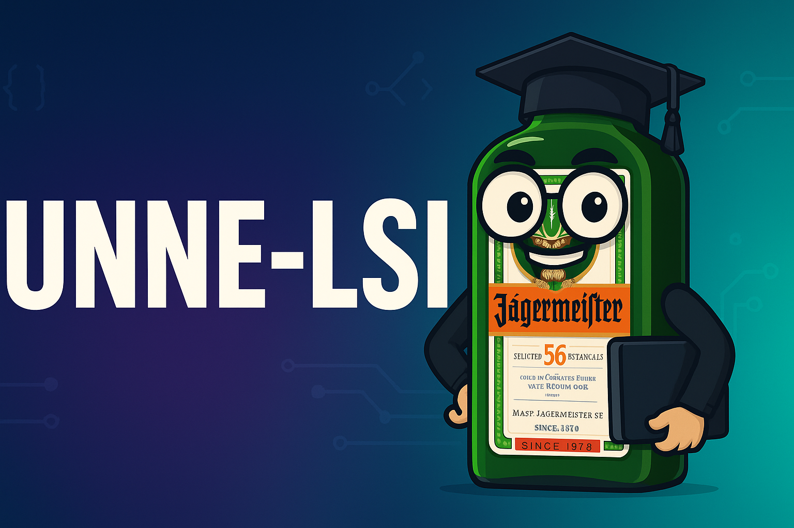
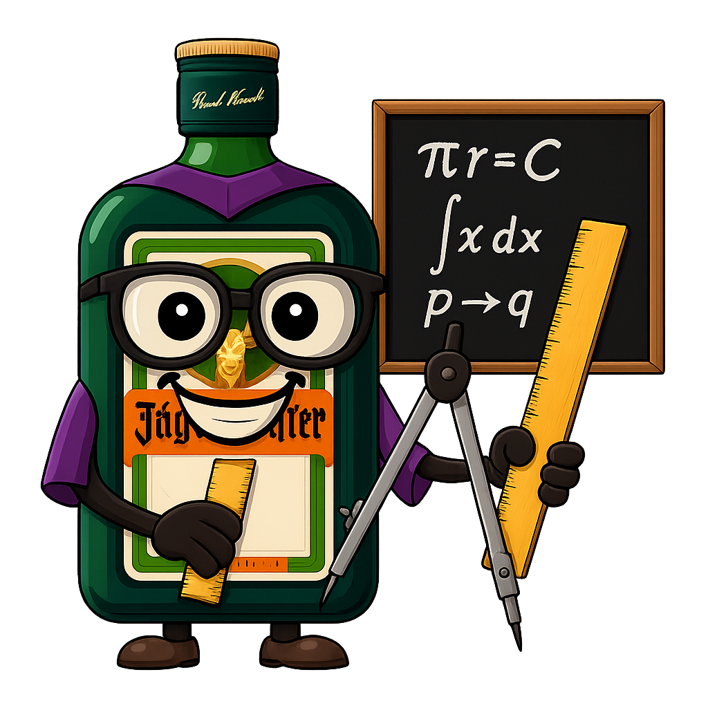
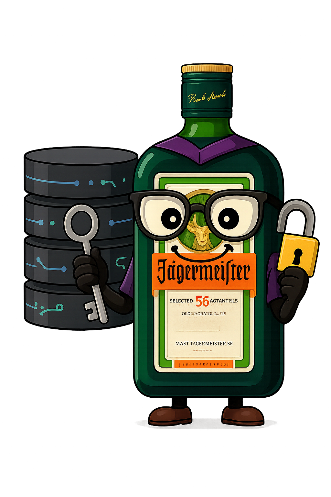

<p align="center">
  
</p>

<p align="center">
  <a href="https://github.com/tobiager">
    
  </a>
</p>

<p align="center">
  
  
  
  
</p>

---

#  LSI UNNE — Apuntes, prácticos y guías por materia

Hola! Soy **Tobias**, ingresé a la carrera en **2023** bajo el **plan 2009** y actualmente estoy en **3er año**.  
Decidí armar este repositorio para dejar un registro de mi recorrido y que también le sirva a quien venga detrás.  

Este espacio **NO es oficial**, pero vas a encontrar **apuntes, prácticos, guías, parciales resueltos y tips de cursada** de la **Licenciatura en Sistemas de Información (FaCENA – UNNE)**.

> “El que estudia con parciales viejos, aprueba dos veces” — proverbio lsi 🧓

---

## 📌 Índice rápido

- [ Sobre la carrera](#-sobre-la-carrera)  
- [ Estructura del repositorio](#-estructura-del-repositorio)  
- [ Planes de estudio](#-planes-de-estudio)  
- [ Tips de cursada](#-tips-de-cursada)  
- [ Cómo contribuir](#%EF%B8%8F-cómo-contribuir)  
- [ Licencia](#-licencia)  

---

## 📖 Sobre la carrera

La **Licenciatura en Sistemas de Información (LSI)** es una carrera de **5 años** dictada en la **Facultad de Ciencias Exactas y Naturales y Agrimensura (FaCENA – UNNE)**, en Corrientes, Argentina.  


### Características principales:
- **Duración oficial:** 5 años.  
- **Planes:** 2009 (en extinción) y 2023 (nuevo).  
- **Modalidad:** presencial, con cuatrimestrales y anuales.  
- **Perfil del egresado:** desarrollo de software, gestión de proyectos, docencia e investigación.  
- **Salida laboral:** analista, programador, sysadmin, project manager, investigador.  


---

## 📂 Estructura del repositorio

```text
Materias/
  ├── <Materia>/README.md   # apuntes, prácticas y consejos
planes/
  ├── 2009.md               # plan 2009 detallado
  └── 2023.md               # plan 2023 detallado
meta/
  └── mapping-planes.yaml   # mapeo materia → {año, cuatri} por plan
assets/
  └── facena.png, stickers  # imágenes usadas en el repo
```

- **Materias/** → Cada carpeta tiene un `README.md` con apuntes, prácticos y consejos.  
- **planes/** → Info detallada de cada plan vigente.  
- **meta/** → Archivos auxiliares para correlatividades.  
- **assets/** → Logos, banners y stickers de Jäger (modo estudiante).  

---

## 🗺️ Planes de estudio

La carrera se dicta bajo dos planes vigentes:

<p>
  <a href="./planes/2009.md">
    
  </a>
  <a href="./planes/2023.md">
    
  </a>
</p>

### 📌 Plan 2009 — Orden de cursada

- **1° año:** AED I, Álgebra, AED II, Lógica, SyO  
- **2° año:** Paradigmas, Arquitectura, Cálculo, POO, SO, Adm. y Gestión  
- **3° año:** Taller I, Comunicaciones, Ing. de Software I, Taller II (cursando), Probabilidad y Estadística (cursando), Bases de Datos I (cursando), Inglés Técnico Informático (pendiente)  
- **4° año:** Ing. de Software II, Economía, Teoría de la Computación, Redes, Bases de Datos II, Métodos Computacionales  
- **5° año:** Proyecto Final, Auditoría y Seguridad, Optativas I–III  

> 🎓 Al aprobar 3° año + Inglés Técnico se obtiene el título intermedio de **Analista Programador Universitario (APU)**.  

👉 Ver detalle completo: [planes/2009.md](./planes/2009.md)  

---

### 📌 Plan 2023 — Orden de cursada

- **1° año:** AED I, Álgebra, AED II, Lógica, SyO  
- **2° año:** Paradigmas, Arquitectura, Cálculo, POO, SO, Bases de Datos I  
- **3° año:** Programación Web, Comunicaciones, Ing. de Software I, Probabilidad y Estadística, Programación Avanzada, Ing. de Software II  
- **4° año:** IA, Teoría de la Computación, Redes, Ing. de Software III, Bases de Datos II, Métodos Computacionales, Análisis de Organizaciones y Procesos  
- **5° año:** Auditoría y Seguridad, Emprendedorismo, Optativa I, Introducción a Ciencia de Datos, Aspectos Profesionales y Sociales, Optativa II, Proyecto Integrador de Carrera  

> 🎓 Al aprobar 3° año + Inglés se obtiene el título de **Analista Programador Universitario (APU)**.  

👉 Ver detalle completo: [planes/2023.md](./planes/2023.md)  


---

## 🧭 Tips de cursada

-  **Parciales viejos** → son oro. Buscalos, pedilos, compartilos.  
-  **Armate grupo de estudio** → nadie aprueba solo en LSI.  
-  **No subestimes las correlativas** → calculá bien qué materias habilitan otras.  
-  **Resumí con tus palabras** → más útil que copiar PDF de 200 páginas.  
-  **Consultá a los profes** → suelen dar pistas de examen.  
-  **Hack**: resolvé parciales anteriores como si fueran mocks.  


---

## 📊 Estado actual del repo

- ✅ AED1 / AED2 → completos  
- ⚠️ POO → en construcción  
- ⚠️ BD → resúmenes parciales  
- ❌ Redes → pendiente  
- 🚧 Talleres → se van actualizando por TP  

---

## 🛠️ Cómo contribuir

1. **Abrí un Issue** con lo que quieras aportar.  
2. (Opcional) armá un **Pull Request** desde una rama `materia/<materia>-<cambio>`.  
3. Todo aporte suma: resúmenes, parciales, PDFs, tips de cursada.  

<p align="center">
  
</p>

---

## 📄 Licencia

- **Apuntes/guías/resúmenes propios:** [CC BY-NC-SA 4.0](https://creativecommons.org/licenses/by-nc-sa/4.0/)  
- **Código/plantillas:** [MIT](./LICENSE)  

<p align="center">
  
</p>

---

<p align="center"><b>❤️🐔 Hecho con pasión y dedicación por Tobias — Que le sirva a alguien más.</b></p>

