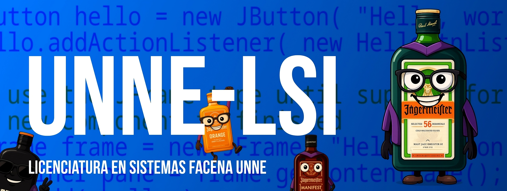
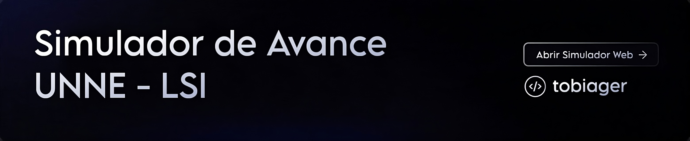
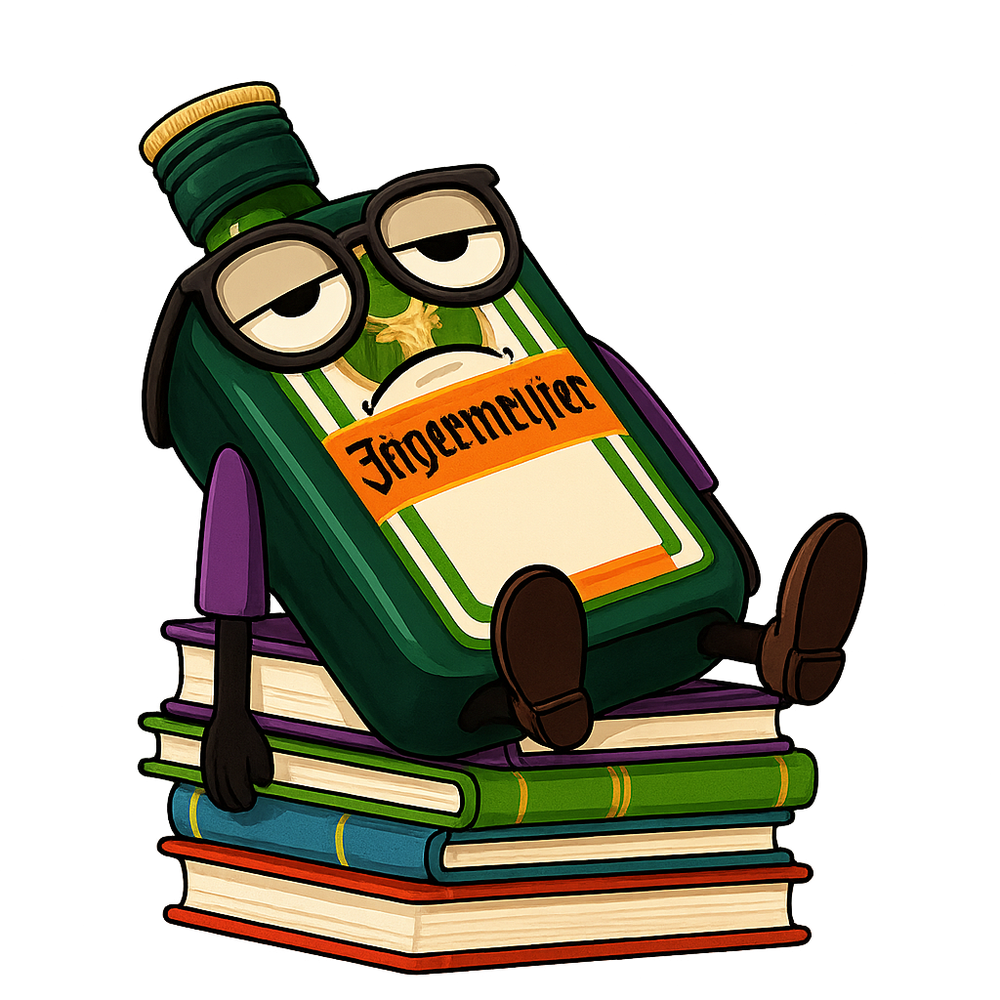
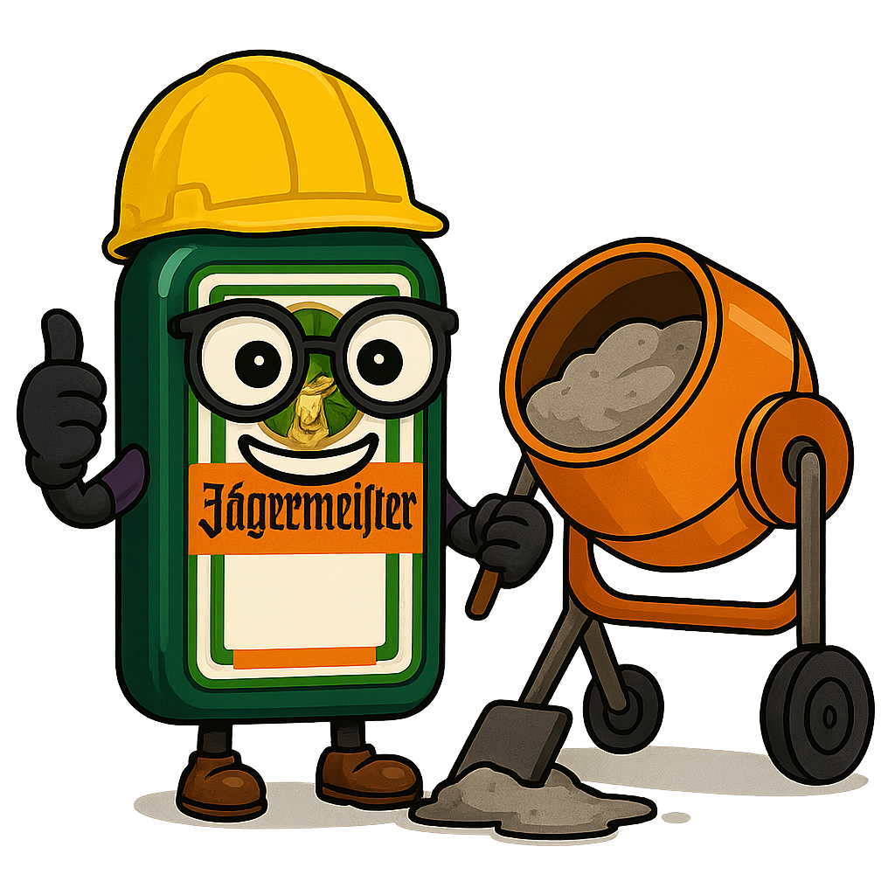
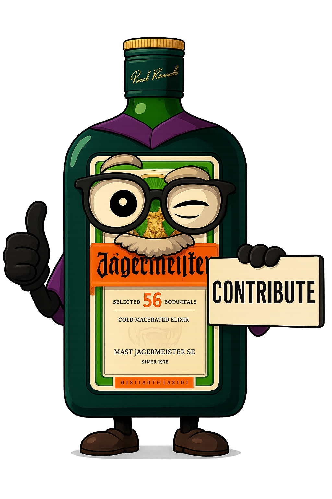
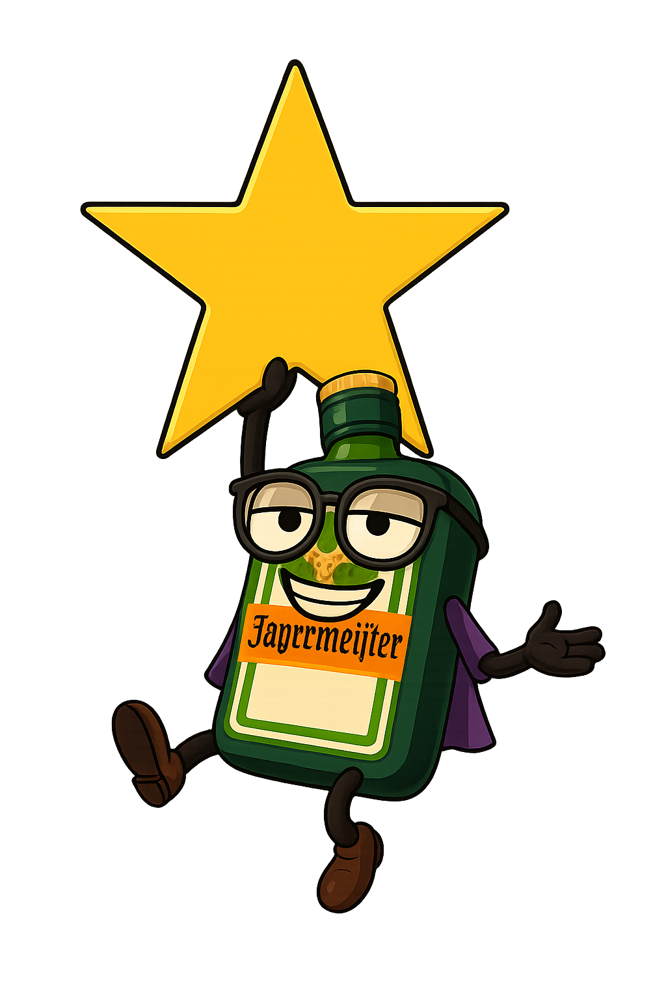

<div align="center">

  <!-- Banner -->
  <a href="https://github.com/tobiager/UNNE-LSI">
    
  </a>

  <!-- Social -->
  <p style="margin-top:20px;">
    <a href="https://github.com/tobiager">
      
    </a>
    <a href="https://github.com/tobiager/UNNE-LSI/stargazers">
      
    </a>
    <a href="https://github.com/tobiager/UNNE-LSI/network/members">
      
    </a>
  </p>

  <!-- Badges de estado del repo -->
  <p>
    
    
   
  </p>

  <!-- Métricas de GitHub -->
  <p>
    <a href="https://github.com/tobiager/UNNE-LSI/pulls">
      
    </a>
    <a href="https://github.com/tobiager/UNNE-LSI/issues">
      
    </a>
    <a href="https://github.com/tobiager/UNNE-LSI/graphs/contributors">
      
    </a>
    <a href="https://github.com/tobiager/UNNE-LSI/blob/main/LICENSE">
      
    </a>
  </p>

  <!-- Nav estilo "Resume Matcher" -->
  <p>
    <a href="#-índice-rápido">Índice Rápido</a> ✦
    <a href="./CONTRIBUTING.md">Cómo Contribuir</a> ✦
    <a href="#-simulador-de-avance-web">Simulador de Avance</a> ✦
    <a href="./Materias">Materias</a> ✦
    <a href="https://github.com/tobiager/UNNE-LSI/issues/new/choose">Sugerir/Reportar</a>
  </p>

</div>

# LSI UNNE — Apuntes, prácticos y guías por materia

Hola! Soy **Tobias**, ingresé a la carrera en **2023** bajo el **plan 2009** y actualmente estoy en **3er año**.  
Decidí armar este repositorio para dejar un registro de mi recorrido y que también le sirva a quien venga detrás.

Este espacio **NO es oficial**, pero vas a encontrar **apuntes, prácticos, guías, parciales resueltos y tips de cursada** de la **Licenciatura en Sistemas de Información (FaCENA – UNNE)**.


> [!NOTE]
> “El que estudia con parciales viejos, aprueba dos veces” — proverbio LSI

---

## 📌 Índice rápido

- [ Sobre la carrera](#-sobre-la-carrera)
- [ Estructura del repositorio](#-estructura-del-repositorio)
- [ Instalación y uso local](#-instalación-y-uso-local)
- [ Si no sabés cómo usar GitHub](#-si-no-sabés-cómo-usar-github)
- [ Planes de estudio](#-planes-de-estudio)
- [ Simulador de Avance (web)](#-simulador-de-avance-web)
- [ Materias](#-materias)
- [ Tips de cursada](#-tips-de-cursada)
- [ Cómo contribuir](#%EF%B8%8F-cómo-contribuir)
- [ Licencia](#-licencia)

---

## 📖 Sobre la carrera

La **Licenciatura en Sistemas de Información (LSI)** es una carrera de **5 años** dictada en la **Facultad de Ciencias Exactas y Naturales y Agrimensura (FaCENA – UNNE)**, en Corrientes, Argentina.  


### Características principales:
- **Duración oficial:** 5 años.  
- **Planes:** 2009 (en extinción) y 2023 (nuevo).  
- **Modalidad:** presencial y virtual, con materias cuatrimestrales.  
- **Perfil del egresado:** desarrollo de software, gestión de proyectos, docencia e investigación.   

---

### 🔎 ¿Qué podés esperar de la carrera?

La LSI te brinda **bases sólidas en informática, matemática, organización y gestión**, que sirven como punto de partida para después orientarte hacia lo que más te guste.  

Durante el cursado vas a ver desde **programación y estructuras de datos** hasta materias de **gestión, ingeniería de software, redes, bases de datos, seguridad, inteligencia artificial** y más.  
Esa variedad hace que cada estudiante pueda descubrir en qué área se siente más cómodo:  
- **Desarrollo de software** (backend, frontend, mobile, videojuegos).  
- **Infraestructura y redes** (administración de servidores, seguridad, cloud).  
- **Datos e investigación** (ciencia de datos, IA, estadística aplicada).  
- **Gestión y consultoría** (liderar proyectos, analizar procesos, trabajo con empresas).  
- **Docencia y academia** (enseñar, investigar y seguir con posgrados).  

> [!IMPORTANT]
>  En resumen: la carrera no te encierra en un solo camino, sino que te da las herramientas para que elijas tu rumbo profesional según tus intereses.  


---

## 📂 Estructura del repositorio

```text
.
├── Materias/             # apuntes, prácticas y consejos por materia
├── planes/               # planes 2009 y 2023 detallados
├── meta/                 # correlatividades y mapeos auxiliares
├── assets/               # imágenes usadas en el repo
├── docs/                 # visualizaciones y sitio estático
├── Roadmap.md            # avance completo de la carrera
├── mkdocs.yml            # configuración de la documentación
└── CONTRIBUTING.md       # cómo contribuir
```

- **Materias/** → Cada carpeta tiene un `README.md` con apuntes, prácticos y consejos.
- **planes/** → Info detallada de cada plan vigente.
- **meta/** → Archivos auxiliares para correlatividades y planes.
- **assets/** → Logos, banners y stickers de Jäger (modo estudiante).
- **docs/** → Páginas y visualizaciones generadas.
- **Roadmap.md** → Progreso completo y plan de cursada.
- **mkdocs.yml** → Configuración para generar la documentación del sitio.
- **CONTRIBUTING.md** → Guía para colaborar con el proyecto.

---

## 💻 Instalación y uso local

Para trabajar con este repositorio en tu máquina:

```bash
git clone https://github.com/tobiager/UNNE-LSI.git
cd UNNE-LSI
# Ejemplo: navegar a la carpeta de una materia
cd Materias/AED1
```

Para generar y previsualizar la documentación del sitio:

```bash
pip install mkdocs mkdocs-material
mkdocs serve
```

## ❓ Si no sabés cómo usar GitHub

<details>
<summary>📥 Descarga rápida (la forma más fácil)</summary>

1. Hacé clic en el botón verde **Code** (arriba a la derecha de este repositorio).  
2. Elegí la opción **Download ZIP**.  
3. Se va a descargar un archivo `.zip` con **todo el contenido del repositorio (≈4 GB)**.  
4. Descomprimilo en tu computadora y listo: vas a ver todas las carpetas de materiales. 🎓  

</details>

---

<details>
<summary>💻 Para usuarios con Git (opcional)</summary>

1. **Creá una cuenta** en [github.com](https://github.com/).  
2. **Instalá Git**: [git-scm.com](https://git-scm.com/).  
3. **Cloná** este repositorio:  
   ```bash
   git clone https://github.com/tobiager/UNNE-LSI.git
Explorá las carpetas desde tu navegador de archivos o la terminal.

Para más información consultá la [documentación oficial de GitHub](https://docs.github.com/es).

</details>

---

## 🧪 Simulador de avance (web)

<div align="center">
  <a href="https://tobiager.github.io/UNNE-LSI/simulador.html">
    
  </a>
  <p style="margin-top:12px;">
    <a href="https://tobiager.github.io/UNNE-LSI/simulador.html">
      
    </a>
    <a href="#cómo-usarlo">
      
    </a>
  </p>
</div>

> Gestioná tu cursada desde el navegador: **elegí plan, marcá estados, guardá notas** y generá **badges** para tu README.

###  ¿Qué podés hacer?
- **Elegir plan**: 2009 o 2023.
- Marcar cada materia como **No**, **En curso**, **Regular** o **Aprobada**.
- **Guardar notas** (final/promo) y ver observaciones (p. ej., “Promocionada con 9”).
- Filtrar por **Solo habilitadas** y **buscar** materias.
- Ver **progreso por año** y **% de carrera** con barras en vivo.
- **Guardar** el avance en el navegador, **reiniciar**, **exportar** y **importar** tu estado en **JSON**.
- Generar **Link de estado** (compartible) para mostrar tu progreso.
- **Copiar badge – Año** o **Copiar badge – %** para pegar directo en tu README.

>  Los datos se guardan **localmente** en tu navegador (LocalStorage). Si cambiás de dispositivo/navegador, usá **Exportar JSON** e **Importar JSON**.

###  Cómo usarlo
1. Entrá al <a href="https://tobiager.github.io/UNNE-LSI/simulador.html">Simulador</a> 
2. Elegí tu **Plan** (2009 / 2023).  
3. Marcá el **estado** de cada materia y cargá **notas** si corresponde.  
4. Tocá **Guardar** para persistir tu avance en el navegador.  
5. (Opcional) **Exportá JSON** para respaldar o mover tu progreso a otra PC.  
6. Usá **Copiar badge – Año** o **Copiar badge – %** y pegalo en cualquier README/Markdown.

> [!NOTE]
> Con **Link de estado** podés compartir tu avance exacto (ideal para CV/portfolio).
<!-- Opcional: agregá capturas del simulador en /assets y descomentá estas líneas
<p align="center">
  <br/>
  <em>Vista de cursada y progreso por año.</em>
</p>
<p align="center">
  <br/>
  <em>Estado de carrera con % y listado por año.</em>
</p>
-->


---

## 📜 Planes de estudio

La carrera se dicta bajo dos planes vigentes:

<p>
  <a href="./planes/2009.md">
    
  </a>
  <a href="./planes/2023.md">
    
  </a>
</p>

### 📌 Plan 2009 — Orden de cursada

- **1° año:** AED I, Álgebra, AED II, Lógica, SyO  
- **2° año:** Paradigmas, Arquitectura, Cálculo, POO, SO, Adm. y Gestión  
- **3° año:** Taller I, Comunicaciones, Ing. de Software I, Taller II (cursando), Probabilidad y Estadística (cursando), Bases de Datos I (cursando), Inglés Técnico Informático (pendiente)  
- **4° año:** Ing. de Software II, Economía, Teoría de la Computación, Redes, Bases de Datos II, Métodos Computacionales  
- **5° año:** Proyecto Final, Auditoría y Seguridad, Optativas I–III  

> 🎓 Al aprobar 3° año + Inglés Técnico se obtiene el título intermedio de **Analista Programador Universitario (APU)**.  

👉 Ver detalle completo: [planes/2009.md](./planes/2009.md)  

---

### 📌 Plan 2023 — Orden de cursada

- **1° año:** AED I, Álgebra, AED II, Lógica, SyO  
- **2° año:** Paradigmas, Arquitectura, Cálculo, POO, SO, Bases de Datos I  
- **3° año:** Programación Web, Comunicaciones, Ing. de Software I, Probabilidad y Estadística, Programación Avanzada, Ing. de Software II  
- **4° año:** IA, Teoría de la Computación, Redes, Ing. de Software III, Bases de Datos II, Métodos Computacionales, Análisis de Organizaciones y Procesos  
- **5° año:** Auditoría y Seguridad, Emprendedorismo, Optativa I, Introducción a Ciencia de Datos, Aspectos Profesionales y Sociales, Optativa II, Proyecto Integrador de Carrera  

> 🎓 Al aprobar 3° año + Inglés se obtiene el título de **Analista Programador Universitario (APU)**.  

👉 Ver detalle completo: [planes/2023.md](./planes/2023.md)

---

## 📚 Materias

Listado de materias con enlaces a sus carpetas y el estado actual.



- [Administración y Gestión de Organizaciones](./Materias/Administracion%20y%20Gestion%20de%20Organizaciones/) — ⏳ Me falta el final
- [Álgebra](./Materias/Algebra/) — ✅ Aprobada
- [Algoritmos y Estructura de Datos I](./Materias/Algoritmo%20y%20Estructura%20de%20datos%201/) — ✅ Aprobada
- [Algoritmos y Estructura de Datos II](./Materias/Algoritmo%20y%20Estructura%20de%20datos%202/) — ✅ Aprobada
- [Arquitectura de Computadoras](./Materias/Arquitectura%20de%20computadoras/) — ✅ Aprobada
- [Cálculo](./Materias/Calculo/) — ⏳ Me falta el final 
- [Comunicación de Datos I](./Materias/Comunicacion%20de%20datos%201/) — ✅ Aprobada
- [Ingeniería de Software I](./Materias/Ingenieria%20de%20Software%201/) — ⏳ Me falta el final 
- [Lógica y Matemática Computacional](./Materias/Logica%20y%20Matematica%20Computacional/) — ✅ Aprobada
- [Paradigmas y Lenguajes](./Materias/Paradigmas%20y%20Lenguajes/) — ✅ Aprobada
- [Programación Orientada a Objetos](./Materias/Programacion%20Orientada%20a%20Objetos/) — ✅ Aprobada
- [Sistemas Operativos](./Materias/Sistemas%20Operativos/) — ✅ Aprobada
- [Sistemas y Organizaciones](./Materias/Sistemas%20y%20Organizaciones/) — ✅ Aprobada
- [Taller de Programación I](./Materias/Taller%20de%20Programacion%201/) — ✅ Aprobada
- [Taller de Programación II](./Materias/Taller%20de%20Programacion%202/) — ⏳ En curso
- [Bases de Datos 1](./Materias/Bases%20de%20Datos%201/) - ⏳ En curso
---

## 🧭 Tips de cursada


- **Parciales viejos** → son oro. Buscalos, pedilos, compartilos.  
- **Armate grupo de estudio** → nadie aprueba solo en LSI.  
- **No subestimes las correlativas** → calculá bien qué materias habilitan otras.  
- **Resumí con tus palabras** → más útil que copiar PDF de 200 páginas.  
- **Consultá a los profes** → suelen dar pistas de examen.  
- **Hack** → resolvé parciales anteriores como si fueran mocks.  


---

## 📊 Estado actual del repo

📌 Actualmente cursando: **3er Año — 2° Cuatrimestre**  
📍 Plan: **2009**  

📈 Avance aproximado:  

<p align="left">
  
</p>

Ver progreso completo [Roadmap](https://github.com/tobiager/UNNE-LSI/blob/main/Roadmap.md)


### Materias en curso
- ⏳ Taller de Programación II  
- ⏳ Probabilidad y Estadística  
- ⏳ Bases de Datos I  
- ⏳ Inglés Técnico Informático  


<p align="center">
  
  
</p>


---

## 🛠️ Cómo contribuir



1. **Abrí un Issue** con lo que quieras aportar.  
2. *(Opcional)* armá un **Pull Request** desde una rama con el formato:  
   `materia/<materia>-<cambio>`  
3. Todo aporte suma: **resúmenes, parciales, PDFs, tips de cursada**.  

Consulta [CONTRIBUTING.md](CONTRIBUTING.md) para más detalles.


<br clear="all"/>

---

## 🤝🏻 Top Contributors

Gracias a todos los que contribuyen al crecimiento de este proyecto. ¡Tu contribución también puede incluirse aquí!

<p align="center">
  <a href="https://github.com/tobiager/UNNE-LSI/graphs/contributors">
    
  </a>
</p>

## 📣 Contacto o Comunidad

- Correo: [tobiasorban00@gmail.com](mailto:tobiasorban00@gmail.com)
- GitHub: [@tobiager](https://github.com/tobiager)
- ¿Consultas o sugerencias? Abrí un [issue](https://github.com/tobiager/UNNE-LSI/issues).

---

## 📜 Licencia

- **Apuntes/guías/resúmenes propios:** [CC BY-NC-SA 4.0](https://creativecommons.org/licenses/by-nc-sa/4.0/)  
- **Código/plantillas:** [MIT](./LICENSE)


---


## ⭐ Apoyá este proyecto

Si este repositorio te fue útil, ayudame compartiéndolo con otros estudiantes y dejando tu ⭐ en GitHub.  

<p align="center">
  <a href="https://github.com/tobiager/UNNE-LSI">
    
  </a>
</p>

<p align="center">
  
</p>

## ⭐ Historia de Estrellas

[](https://star-history.com/#tobiager/UNNE-LSI&Date)

<p align="center"><b>❤️🐔 Hecho con pasión y dedicación por Tobias — Que le sirva a alguien más.</b></p>

